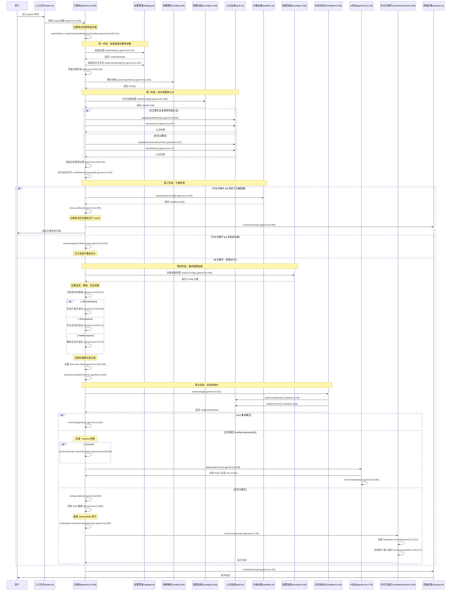
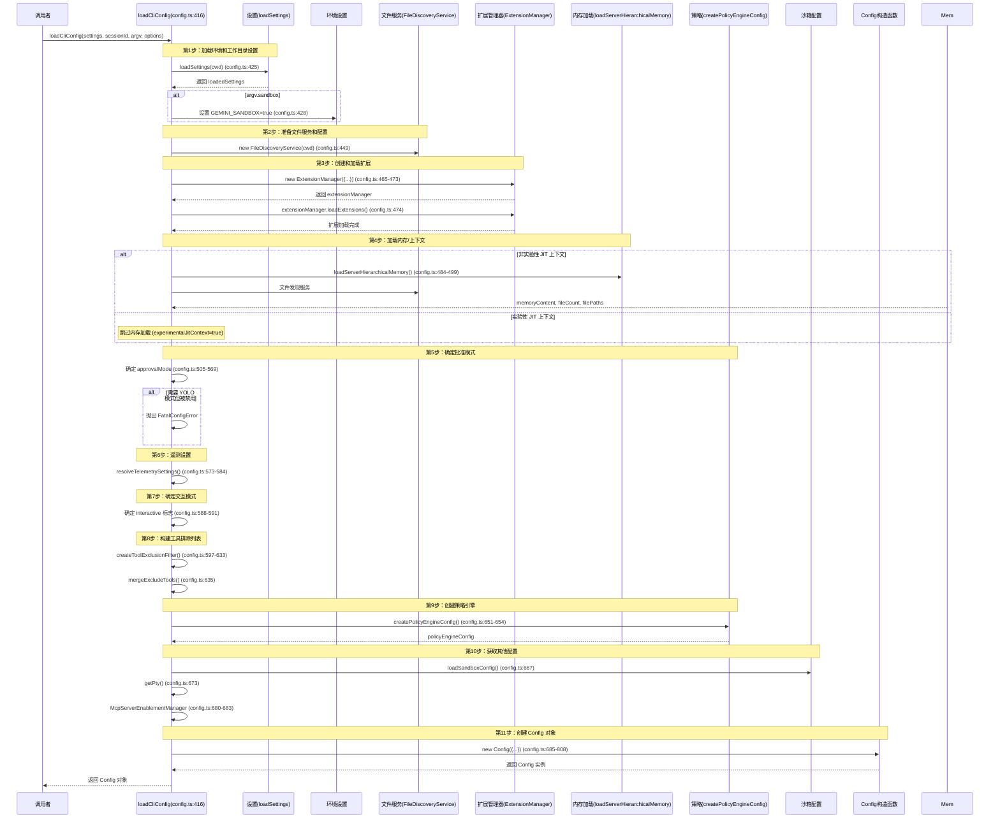
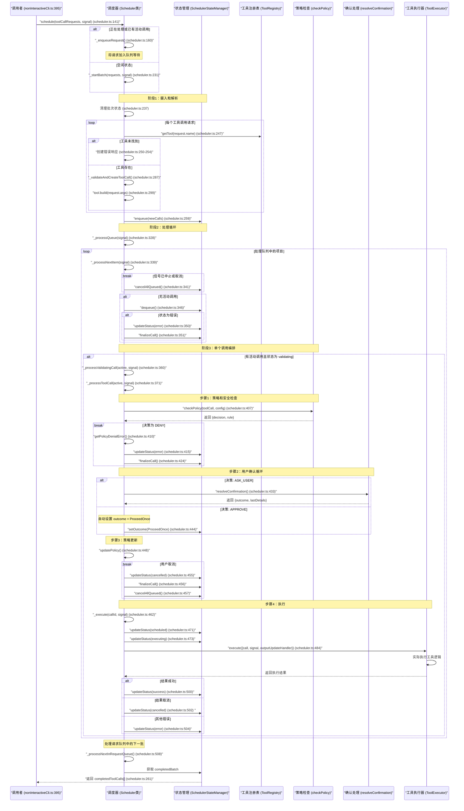
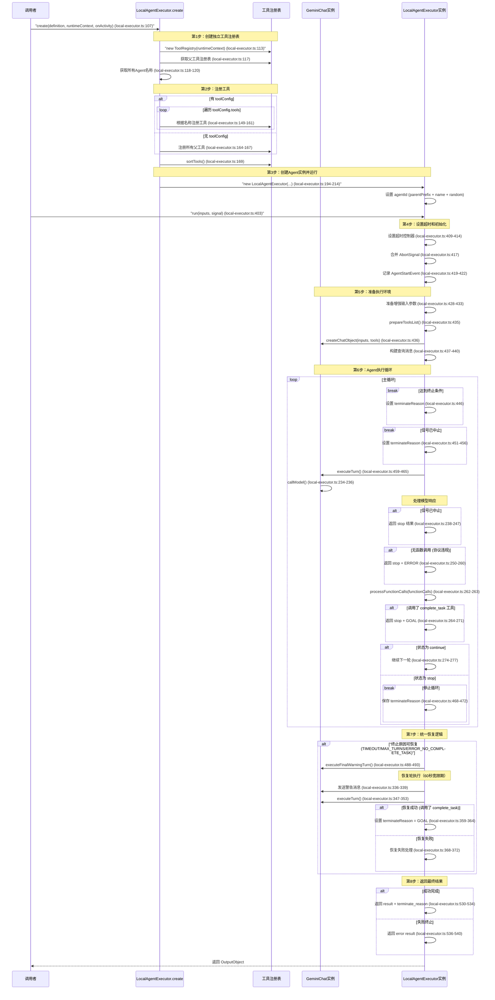
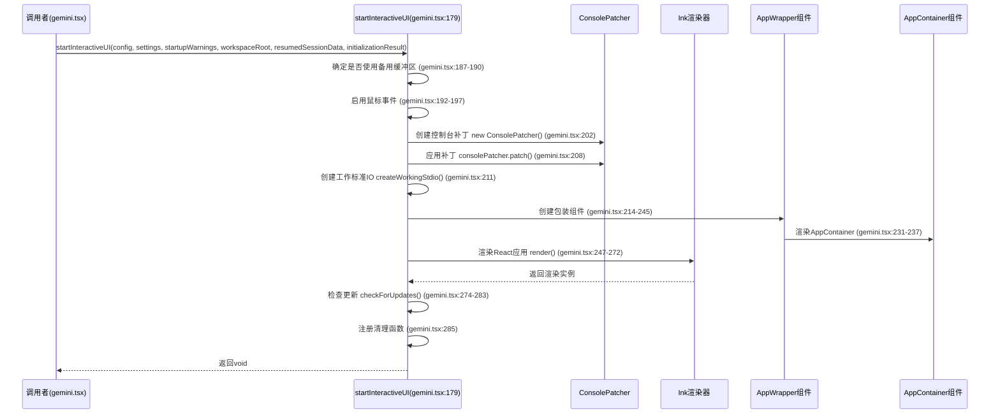

# Gemini CLI 详细序列图（包含文件路径和行号）

## 主启动序列

### 序列图 1: CLI 启动流程



## 配置加载详细序列

### 序列图 2: loadCliConfig() 详细流程



## 非交互模式执行详细序列

### 序列图 3: runNonInteractive() 详细流程

```mermaid
sequenceDiagram
    participant Caller as 调用者
    participant RunNI as runNonInteractive(nonInteractiveCli.ts:58)
    participant ConsolePatcher as 控制台补丁
    participant OutputFormat as 输出格式器
    participant Scheduler as 调度器(Scheduler)
    participant GeminiClient as Gemini客户端
    participant SlashCmd as 斜杠命令处理器
    participant AtCmd as @命令处理器
    participant AbortCtrl as AbortController

    Caller->>RunNI: runNonInteractive({config, settings, input, prompt_id})

    Note over RunNI,ConsolePatcher: 第1步：初始化
    RunNI->>ConsolePatcher: new ConsolePatcher() (nonInteractiveCli.ts:66-72)
    RunNI->>RunNI: registerActivityLogger() 如果启用 (nonInteractiveCli.ts:74-79)
    RunNI->>OutputFormat: 创建 TextOutput (nonInteractiveCli.ts:81-82)
    RunNI->>AbortCtrl: new AbortController() (nonInteractiveCli.ts:102)

    Note over RunNI: 第2步：设置 stdin 取消监听
    RunNI->>RunNI: setupStdinCancellation() (nonInteractiveCli.ts:112-159)
    Note over RunNI: 设置 Ctrl+C 检测和 AbortController

    Note over RunNI,OutputFormat: 第3步：创建调度器和客户端
    RunNI->>Scheduler: new Scheduler({...}) (nonInteractiveCli.ts:213-218)
    RunNI->>GeminiClient: config.getGeminiClient() (nonInteractiveCli.ts:212)

    alt 恢复会话
        RunNI->>GeminiClient: resumeChat(convertSessionToHistoryFormats()) (nonInteractiveCli.ts:222-228)
    end

    Note over RunNI: 第4步：发送初始化事件(流式JSON)
    alt 使用 STREAM_JSON 输出格式
        RunNI->>OutputFormat: emitEvent(INIT) (nonInteractiveCli.ts:231-238)
    end

    Note over RunNI,SlashCmd: 第5步：处理输入
    alt 输入是斜杠命令
        RunNI->>SlashCmd: handleSlashCommand() (nonInteractiveCli.ts:242-255)
        SlashCmd-->>RunNI: 返回 query(Part[])
    else 输入不是斜杠命令
        RunNI->>AtCmd: handleAtCommand() (nonInteractiveCli.ts:258-275)
        AtCmd-->>RunNI: 返回 processedQuery(Part[])
        alt 处理出错
            RunNI->>RunNI: 抛出 FatalInputError (nonInteractiveCli.ts:270-272)
        end
    end

    RunNI->>RunNI: 发送用户消息事件 (nonInteractiveCli.ts:278-285)

    Note over RunNI,GeminiClient: 第6步：主执行循环
    loop 对话轮次
        RunNI->>RunNI: 检查最大轮次 (nonInteractiveCli.ts:292-297)

        RunNI->>GeminiClient: sendMessageStream(..., abortController.signal) (nonInteractiveCli.ts:300-307)

        Note over RunNI: 第7步：处理流式响应
        loop 流式事件
            GeminiClient-->>RunNI: GeminiEventType
            alt 检查到取消信号
                RunNI->>RunNI: handleCancellationError() (nonInteractiveCli.ts:312)
            end

            alt 事件类型: Content
                RunNI->>RunNI: 输出内容 (nonInteractiveCli.ts:315-333)
            else 事件类型: ToolCallRequest
                RunNI->>RunNI: 收集到 toolCallRequests (nonInteractiveCli.ts:334-344)
                alt 使用 STREAM_JSON
                    RunNI->>OutputFormat: emitEvent(TOOL_USE) (nonInteractiveCli.ts:336-342)
                end
            else 事件类型: LoopDetected
                RunNI->>RunNI: 记录循环检测 (nonInteractiveCli.ts:345-353)
            else 事件类型: MaxSessionTurns
                RunNI->>RunNI: 记录超轮次 (nonInteractiveCli.ts:354-362)
            else 事件类型: Error
                RunNI->>RunNI: 抛出错误 (nonInteractiveCli.ts:364)
            else 事件类型: AgentExecutionStopped
                RunNI->>RunNI: 处理Agent停止 (nonInteractiveCli.ts:365-384)
                RunNI->>RunNI: 跳出主循环
            else 事件类型: AgentExecutionBlocked
                RunNI->>RunNI: 处理Agent阻塞 (nonInteractiveCli.ts:385-390)
            end
        end

        Note over RunNI,Scheduler: 第8步：处理工具调用
        alt 有工具调用请求
            RunNI->>RunNI: textOutput.ensureTrailingNewline() (nonInteractiveCli.ts:394)
            RunNI->>Scheduler: schedule(toolCallRequests, signal) (nonInteractiveCli.ts:395-398)
            Scheduler-->>RunNI: completedToolCalls[]

            Note over RunNI: 处理每个完成的工具调用
            loop 遍历 completedToolCalls
                alt 使用 STREAM_JSON
                    RunNI->>OutputFormat: emitEvent(TOOL_RESULT) (nonInteractiveCli.ts:405-422)
                end

                alt 工具执行出错
                    RunNI->>RunNI: handleToolError() (nonInteractiveCli.ts:426-434)
                end

                alt 工具有响应部分
                    RunNI->>RunNI: 收集 toolResponseParts (nonInteractiveCli.ts:437-440)
                end
            end

            RunNI->>RunNI: recordToolCallInteractions() (nonInteractiveCli.ts:450-455)

            alt 有停止执行工具
                RunNI->>RunNI: 输出停止消息 (nonInteractiveCli.ts:463-467)
                RunNI->>RunNI: 跳出主循环
            end

            RunNI->>GeminiClient: 准准备下一轮消息 (nonInteractiveCli.ts:494)
        else 无工具调用
            RunNI->>RunNI: 输出最终结果 (nonInteractiveCli.ts:496-514)
            RunNI->>RunNI: 跳出主循环
        end
    end

    Note over RunNI: 第9步：清理
    RunNI->>RunNI: cleanupStdinCancellation() (nonInteractiveCli.ts:522)
    RunNI->>ConsolePatcher: cleanup() (nonInteractiveCli.ts:524)

    alt 有错误发生
        RunNI->>RunNI: handleError(error) (nonInteractiveCli.ts:529)
    end

    RunNI-->>Caller: 返回 void
```



## 工具调用详细序列

### 序列图 4: 调度器工具调用流程



## Agent 执行详细序列

### 序列图 5: 本地Agent执行流程



## 交互模式UI启动序列

### 序列图 6: 交互式UI启动流程



## 关键文件路径参考

### 核心文件位置

| 文件       | 路径                                    | 主要功能                   |
| ---------- | --------------------------------------- | -------------------------- |
| CLI入口    | `packages/cli/index.ts`                 | CLI二进制入口，异常处理    |
| 主模块     | `packages/cli/src/gemini.tsx`           | 主应用逻辑，启动流程编排   |
| 参数解析   | `packages/cli/src/config/config.ts`     | CLI参数解析和验证          |
| 设置管理   | `packages/cli/src/config/settings.ts`   | 设置加载、合并、持久化     |
| 非交互模式 | `packages/cli/src/nonInteractiveCli.ts` | 非交互执行逻辑             |
| 应用初始化 | `packages/cli/src/core/initializer.ts`  | 应用启动初始化、认证、主题 |
| UI容器     | `packages/cli/src/ui/AppContainer.tsx`  | 主UI组件                   |

### 核心包文件位置

| 文件        | 路径                                           | 主要功能                       |
| ----------- | ---------------------------------------------- | ------------------------------ |
| Config类    | `packages/core/src/config/config.ts`           | 全局配置管理、工具/Agent注册表 |
| 工具注册表  | `packages/core/src/tools/tool-registry.ts`     | 工具注册、查找、排序           |
| 调度器      | `packages/core/src/scheduler/scheduler.ts`     | 工具调用调度、策略检查         |
| 状态管理器  | `packages/core/src/scheduler/state-manager.ts` | 调度器状态管理                 |
| 工具执行器  | `packages/core/src/scheduler/tool-executor.ts` | 工具实际执行                   |
| Agent执行器 | `packages/core/src/agents/local-executor.ts`   | 本地Agent执行、循环控制        |
| Agent注册表 | `packages/core/src/agents/registry.ts`         | Agent注册、查找                |
| Gemini聊天  | `packages/core/src/chat/gemini-chat.ts`        | Gemini API交互                 |

## 关键方法调用链

### 主流程调用链

1. **完整启动流程（包含沙箱处理）**

   ```
   index.ts:main() → gemini.tsx:main()
     → loadSettings()                           # 加载设置
     → parseArguments()                       # 解析参数
     → loadCliConfig() (第1次)              # 初步配置（用于认证刷新）
     → refreshAuth()                           # 刷新认证
     → start_sandbox() 或 relaunchAppInChildProcess()  # 沙箱或子进程
     → loadCliConfig() (第2次)              # 完整配置加载
     → initializeApp()                         # 应用初始化
     → startInteractiveUI() 或 runNonInteractive() # 进入UI或非交互模式
   ```

2. **配置加载链**

   ```
   loadCliConfig() (config.ts:416)
     → loadSettings()                          # 加载工作区设置
     → ExtensionManager 构造和 loadExtensions()  # 创建并加载扩展
     → loadServerHierarchicalMemory()            # 加载内存/上下文
     → resolveTelemetrySettings()                # 解析遥测设置
     → createPolicyEngineConfig()                # 创建策略引擎配置
     → loadSandboxConfig()                     # 加载沙箱配置
     → new Config()                            # 创建配置对象
   ```

3. **非交互模式调用链**

   ```
   runNonInteractive() (nonInteractiveCli.ts:58)
     → setupStdinCancellation()                 # 设置Ctrl+C监听
     → new Scheduler()                          # 创建调度器
     → getGeminiClient()                      # 获取Gemini客户端
     → handleSlashCommand() 或 handleAtCommand()  # 处理命令
     → sendMessageStream()                       # 发送消息流
     → Scheduler.schedule()                      # 调度工具调用
     → 处理流式响应循环 → 返回结果
   ```

4. **工具调度链**

   ```
   Scheduler.schedule() (scheduler.ts:141)
     → _startBatch()                          # 批处理启动
     → _validateAndCreateToolCall()              # 验证和创建工具调用
     → _processQueue()                         # 处理队列
     → _processNextItem()                      # 处理下一项
     → _processValidatingCall()                # 处理验证中的调用
     → _processToolCall()                      # 处理工具调用
       → checkPolicy()                          # 策略检查
       → resolveConfirmation()                    # 用户确认（如需要）
       → ToolExecutor.execute()                   # 执行工具
   ```

5. **Agent执行链**

   ```
   LocalAgentExecutor.create() (local-executor.ts:107)
     → new ToolRegistry(独立)                   # 创建独立工具注册表
     → 注册父工具到独立注册表
     → new LocalAgentExecutor()

   LocalAgentExecutor.run() (local-executor.ts:403)
     → createChatObject()                      # 创建聊天对象
     → 执行循环:
       → executeTurn()                         # 执行一轮
         → callModel()                          # 调用模型
         → processFunctionCalls()                 # 处理函数调用
         → scheduleAgentTools()                  # 调度Agent工具
       → 检查终止条件（超时、最大轮次）
       → 恢复逻辑（如需要）
   ```

## WebStorm 调试断点建议

### 启动流程断点

| 调试目标       | 文件路径                      | 行号 | 说明                   |
| -------------- | ----------------------------- | ---- | ---------------------- |
| main入口       | `packages/cli/src/gemini.tsx` | 294  | main() 函数入口        |
| 设置加载       | `packages/cli/src/gemini.tsx` | 313  | loadSettings()         |
| 参数解析       | `packages/cli/src/gemini.tsx` | 335  | parseArguments()       |
| 初步配置       | `packages/cli/src/gemini.tsx` | 385  | 第一次 loadCliConfig() |
| 沙箱检查       | `packages/cli/src/gemini.tsx` | 446  | 沙箱判断               |
| 完整配置       | `packages/cli/src/gemini.tsx` | 509  | 第二次 loadCliConfig() |
| 应用初始化     | `packages/cli/src/gemini.tsx` | 611  | initializeApp()        |
| 交互模式入口   | `packages/cli/src/gemini.tsx` | 658  | startInteractiveUI()   |
| 非交互模式入口 | `packages/cli/src/gemini.tsx` | 743  | runNonInteractive()    |

### 配置加载断点

| 调试目标     | 文件路径                            | 行号 | 说明                              |
| ------------ | ----------------------------------- | ---- | --------------------------------- |
| 配置加载入口 | `packages/cli/src/config/config.ts` | 416  | loadCliConfig()                   |
| 扩展管理创建 | `packages/cli/src/config/config.ts` | 465  | ExtensionManager 构造             |
| 扩展加载     | `packages/cli/src/config/config.ts` | 474  | extensionManager.loadExtensions() |
| 内存加载     | `packages/cli/src/config/config.ts` | 484  | loadServerHierarchicalMemory()    |
| 策略创建     | `packages/cli/src/config/config.ts` | 651  | createPolicyEngineConfig()        |
| Config构造   | `packages/cli/src/config/config.ts` | 685  | new Config()                      |

### 非交互模式断点

| 调试目标     | 文件路径                                 | 行号 | 说明                                |
| ------------ | ---------------------------------------- | ---- | ----------------------------------- |
| 非交互入口   | `packages/cli/src/nonInteractiveCli.ts`  | 58   | runNonInteractive()                 |
| 调度器创建   | `packages/cli/src/nonInteractiveCli.ts`  | 213  | new Scheduler()                     |
| 消息发送     | `packages`/cli/src/nonInteractiveCli.ts` | 300  | sendMessageStream()                 |
| 流式响应处理 | `packages/cli/src/nonInteractiveCli.ts`  | 310  | for await (event of responseStream) |
| 工具调用处理 | `packages/cli/src/nonInteractiveCli.ts`  | 334  | ToolCallRequest 事件                |
| 调度器调用   | `packages/cli/src/nonInteractiveCli.ts`  | 395  | scheduler.schedule()                |

### 调度器断点

| 调试目标   | 文件路径                                   | 行号 | 说明                          |
| ---------- | ------------------------------------------ | ---- | ----------------------------- |
| 调度入口   | `packages/core/src/scheduler/scheduler.ts` | 141  | schedule()                    |
| 批处理启动 | `packages/core/src/scheduler/scheduler.ts` | 231  | \_startBatch()                |
| 工具验证   | `packages/core/src/scheduler/scheduler.ts` | 287  | \_validateAndCreateToolCall() |
| 队列处理   | `packages/core/src/scheduler/scheduler.ts` | 328  | \_processQueue()              |
| 策略检查   | `packages/core/src/scheduler/scheduler.ts` | 407  | checkPolicy()                 |
| 工具执行   | `packages/core/src/scheduler/scheduler.ts` | 470  | \_execute()                   |

### Agent执行断点

| 调试目标  | 文件路径                                     | 行号 | 说明                |
| --------- | -------------------------------------------- | ---- | ------------------- |
| Agent创建 | `packages/core/src/agents/local-executor.ts` | 107  | create()            |
| 工具注册  | `packages/core/src/agents/local-executor.ts` | 149  | registerToolByName  |
| Agent运行 | `packages/core/src/agents/local-executor.ts` | 403  | run()               |
| 执行循环  | `packages/core/src/agents/local-executor.ts` | 442  | while (true) 主循环 |
| 一轮执行  | `packages/core/src/agents/local-executor.ts` | 223  | executeTurn()       |
| 模型调用  | `packages/core/src/agents/local-executor.ts` | 234  | callModel()         |

## 总结

Gemini
CLI 的架构设计体现了清晰的关注点分离和模块化设计。通过上述序列图可以清楚地看到：

1. **启动阶段**：参数解析、配置加载、认证刷新、沙箱检查
2. **配置阶段**：扩展加载、内存加载、策略创建、配置对象构建
3. **执行阶段**：根据模式选择交互或非交互路径
4. **工具调用**：通过调度器协调工具执行、策略检查、用户确认
5. **Agent系统**：独立的执行环境、工具注册、循环控制、恢复机制
6. **UI系统**：React-based终端界面、提供丰富的交互体验

每个模块都有明确的职责边界，通过标准接口进行通信，使得系统易于维护、测试和扩展。
