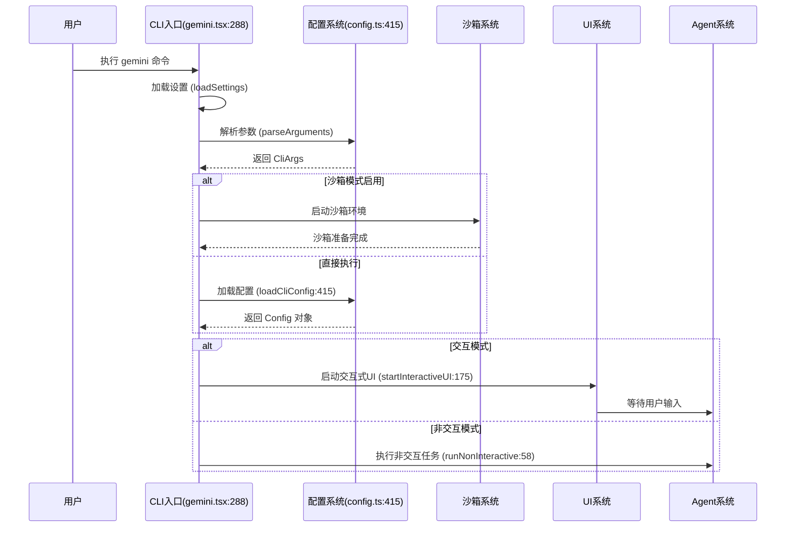
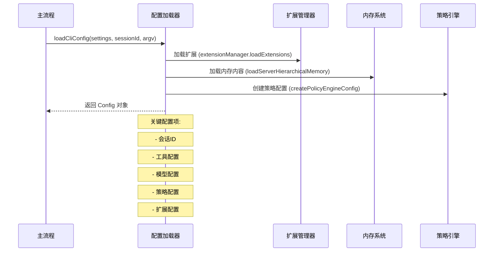
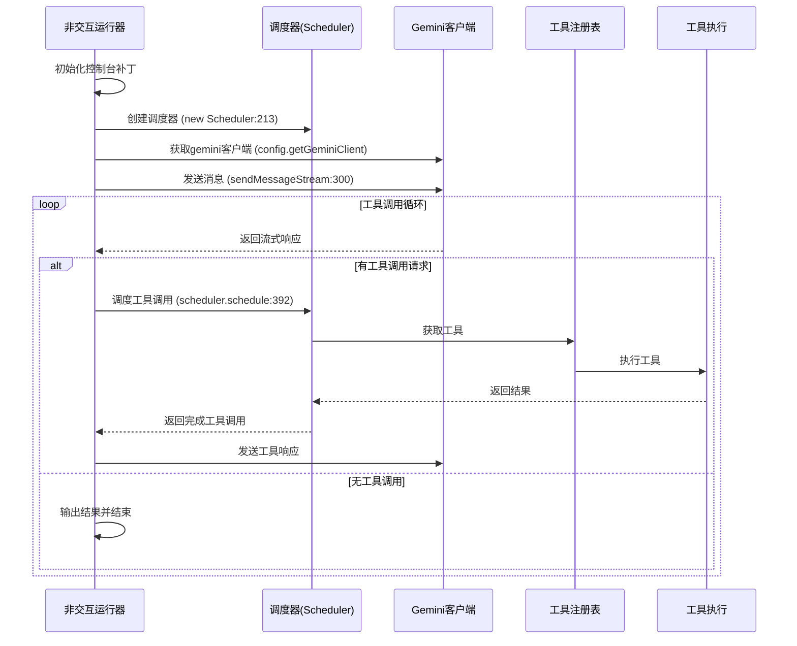
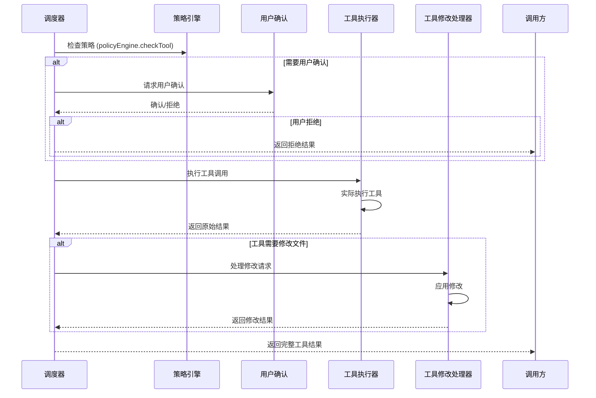
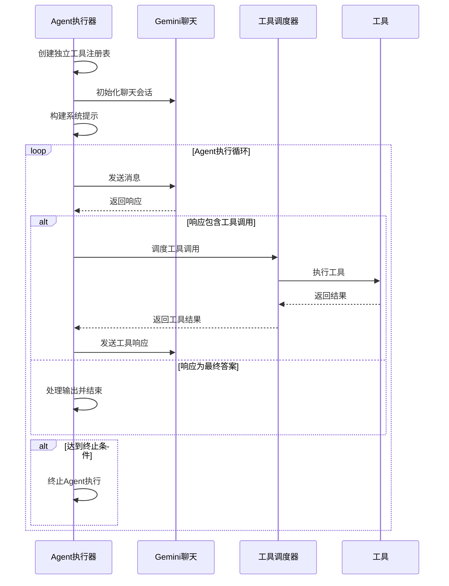

# Gemini CLI 工作流程分析

## 概述

Gemini CLI 是一个基于 Google
Gemini 模型的代码助手工具，它提供了一个交互式终端界面，允许开发者通过自然语言与 AI 代理进行交互，执行代码分析、文件编辑、系统命令等任务。

## 架构概览

Gemini CLI 采用分层架构设计：

1. **CLI 层** (`packages/cli/`) - 用户界面和命令行处理
2. **核心层** (`packages/core/`) - 业务逻辑、工具系统、Agent 管理
3. **服务层** (`packages/a2a-server/`) - Agent-to-Agent 通信
4. **扩展层** (`packages/vscode-ide-companion/`) - IDE 集成

## 主要工作流程

### 1. 启动流程

**入口点**: `packages/cli/src/gemini.tsx:main()`



### 2. 配置加载流程 (`config.ts:loadCliConfig()`)



### 3. 非交互模式执行流程 (`nonInteractiveCli.ts:runNonInteractive()`)



### 4. 工具调用流程 (`Scheduler` 类)



### 5. Agent 执行流程 (`agents/local-executor.ts`)



## 关键组件分析

### 1. 配置系统 (`Config` 类)

**位置**: `packages/core/src/config/config.ts`

**职责**:

- 管理全局配置状态
- 提供工具注册表访问
- 管理会话状态
- 协调扩展和MCP服务器

**关键方法**:

- `getToolRegistry()` - 获取工具注册表
- `getGeminiClient()` - 获取Gemini客户端
- `getMessageBus()` - 获取消息总线
- `getPolicyEngine()` - 获取策略引擎

### 2. 工具系统 (`ToolRegistry` 类)

**位置**: `packages/core/src/tools/toolRegistry.ts`

**职责**:

- 注册和管理所有可用工具
- 处理工具调用
- 管理工具权限和策略

**工具类型**:

1. **文件操作工具**: `read_file`, `write_file`, `glob`, `grep`
2. **系统工具**: `ls`, `shell`
3. **编辑工具**: `edit`
4. **网络工具**: `web_fetch`, `web_search`
5. **内存工具**: `memoryTool`
6. **MCP工具**: `mcp-tool`

### 3. 调度器系统 (`Scheduler` 类)

**位置**: `packages/core/src/scheduler/scheduler.ts`

**职责**:

- 协调工具调用执行
- 处理用户确认
- 管理工具修改
- 执行策略检查

**关键特性**:

- 支持并行工具执行
- 处理工具修改冲突
- 集成策略引擎
- 支持取消操作

### 4. Agent 系统 (`AgentRegistry` 类)

**位置**: `packages/core/src/agents/registry.ts`

**内置Agent类型**:

1. **Generalist Agent** - 通用目的Agent，可访问所有工具
2. **Codebase Investigator** - 代码库分析专用Agent
3. **CLI Help Agent** - CLI帮助和文档Agent

**Agent执行流程**:

1. Agent注册和发现
2. 创建独立工具注册表
3. 执行Agent循环
4. 处理工具调用
5. 返回结构化输出

### 5. 内存系统 (`memoryTool`)

**位置**: `packages/core/src/tools/memoryTool.ts`

**功能**:

- 加载项目文件到内存
- 提供代码上下文
- 支持文件过滤和排除
- 集成文件发现服务

## 数据流分析

### 1. 用户输入处理

```
用户输入 → 参数解析 → 配置加载 → 模式判断 → 执行相应流程
```

### 2. 模型交互流程

```
用户消息 → 预处理(@命令) → Gemini API → 解析响应 → 工具调用 → 结果返回 → 下一轮交互
```

### 3. 工具调用链

```
工具请求 → 策略检查 → 用户确认 → 工具执行 → 结果处理 → 响应返回
```

## 安全机制

### 1. 沙箱环境

- Docker容器隔离
- 文件系统限制
- 网络访问控制

### 2. 策略引擎

- 工具权限控制
- 用户确认要求
- 安全策略执行

### 3. 文件夹信任

- 可信文件夹检查
- 权限提升控制
- 安全模式切换

## 扩展性设计

### 1. MCP (Model Context Protocol) 支持

- 集成外部工具服务器
- 动态工具发现
- 标准化协议

### 2. 扩展系统

- 动态加载扩展
- 扩展权限管理
- 扩展间通信

### 3. 钩子系统 (Hooks)

- 会话生命周期钩子
- 工具调用钩子
- 自定义事件处理

## 性能优化

### 1. 内存管理

- 分层内存加载
- 文件过滤机制
- 上下文压缩

### 2. 流式处理

- 实时响应输出
- 渐进式工具调用
- 并行执行优化

### 3. 缓存策略

- 模型响应缓存
- 文件系统缓存
- 配置缓存

## 总结

Gemini CLI 是一个复杂但设计良好的AI辅助开发工具，其主要特点包括：

1. **模块化架构**: 清晰的层分离，便于维护和扩展
2. **灵活的执行模式**: 支持交互式和非交互式两种模式
3. **强大的工具系统**: 丰富的内置工具和扩展机制
4. **安全第一的设计**: 多层次安全控制和权限管理
5. **优秀的用户体验**: 响应式终端界面和智能交互

该系统的核心创新在于将AI代理、工具调用和安全策略深度集成，为开发者提供了一个安全、高效、智能的代码助手环境。
